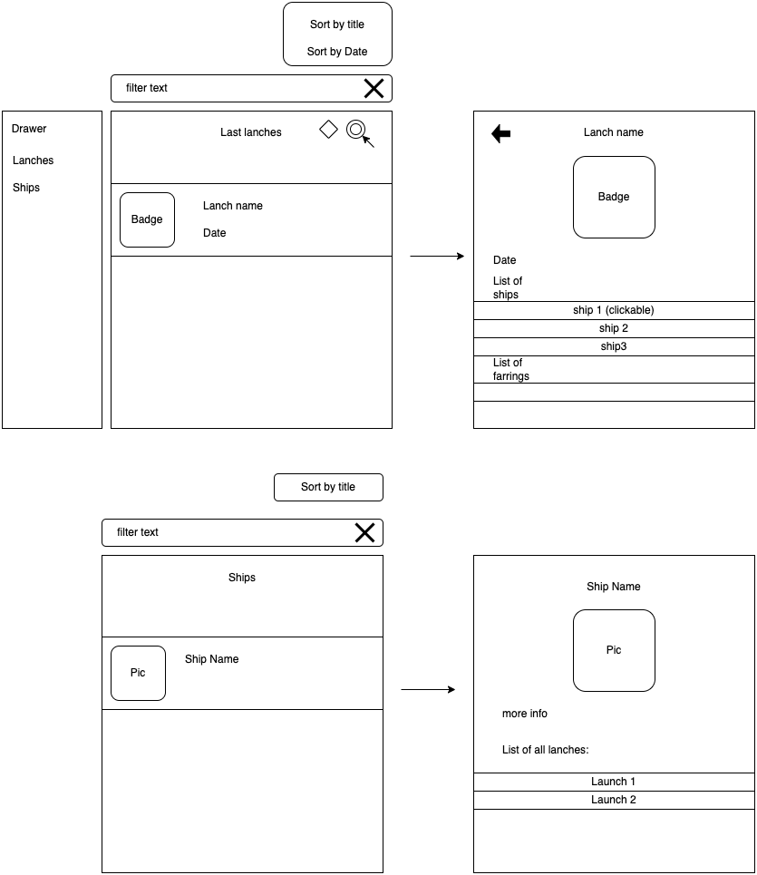

id: app-development-gini-sum-app-example
summary: sum all app example
authors: Shay markovich

# Sum all app example
<!-- ------------------------ -->
##General
In this codelab you we will sum all the code labs and create sample activity with the thing we learn

<!-- ------------------------ -->
## summery of all
you learn diffrent thing about app develop now lets make a simple app

<!-- ------------------------ -->
## App
In this section you will build app with all the thing you learn so far

### Porpuse
The app allow us to see spacex lanches details

you can see screen diagram in:
[screen digram](https://drive.google.com/file/d/1RSNoSaBu_SoksxpBnM9iQvJ1YCFjV6tV/view?usp=sharing)

screens:
1. "last lanches" list
2. launch details
2. "all ships" list
4. ships detail

#### 1. last lanches list:
title = lanch list
filter by (search line):
    - title

sorting by: 
- date
- title

cell: 
- badge
- title
- date

#### 2. lanch details:
title = name of the lanch
    - title
    - badge 
    - date
    - ship list
    - farring list

#### 3. ship list:
title = ship list
filter by (serch line):
- title

sorting by:
- title

cell:
- pic
- title

#### 4. ship detail:
title = name of the ship
- pic
- title
- more info
- list of all the lanches

drawer menu with
1. latest lanches
2. ships

refresh to reload

use https://github.com/r-spacex/SpaceX-API

### add work manager:
every day check for changes in lanches, 
and if changed - publish new notification to the user
when press the notification - the lanch details will be opened, 
when press back the launch list will oppened

### tests
[tarining testing](https://developer.android.com/codelabs/advanced-android-kotlin-training-testing-basics#0)

### stack:

- navigation components - navigation between fragment
- newtwork calls retrofit - calls to the api
- room database - save data in room database for online and offline use
- Use case - need to see how to do it
- view model
- fragment
- single activity
- live data - pass data to the ui - from the view model to the fragment
- flow - pass data betweens layers

<!-- ------------------------ -->
## Return to main
[return to main](../)